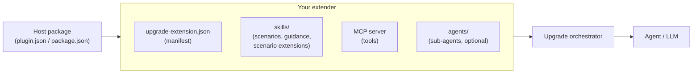

# Upgrade Agent — Extender Samples

Reference samples and documentation for **extending the GitHub Copilot
modernization (Upgrade) agent** with your own language, framework, or
cloud-migration support.

The Upgrade agent is built around a small **orchestrator** that coordinates
independent **extenders**. An extender teaches the agent how to modernize a
particular technology by contributing:

- **Skills** — Markdown playbooks that tell the agent *what* to do and *when*.
  A skill can be a **scenario** (a workflow of your own), **on-demand guidance**,
  or a **scenario extension** that injects your rules into a migration the
  orchestrator already owns.
- **An MCP server** — an optional process exposing *tools* the agent can call
  to inspect and transform a repository.
- **Sub-agents** — optional hidden worker agents, each able to declare **its
  own** MCP server, that run in their own context window.

You package an extender for a host:

- a **GitHub Copilot CLI plugin**, or
- a **VS Code extension**.

Both hosts use the **same extender contract** — the same `upgrade-extension.json`
manifest, the same skills format, and the same MCP tool surface. Only the
packaging differs.

## What's in here

| Path | What it is |
|------|------------|
| [`docs/`](docs/) | The extender guide — every moving part explained. Start at [`docs/README.md`](docs/README.md). |
| [`samples/copilot-cli-plugin/`](samples/copilot-cli-plugin/) | A sample extender packaged as a Copilot CLI plugin (manifest + skills + an MCP launch command). |
| [`samples/vscode-extension/`](samples/vscode-extension/) | The same extender packaged as a VS Code extension. |

The samples implement a fictional third-party extender — **"Fabrikam Suite
Upgrade"** (`upgrade-fabrikam`) — that migrates .NET solutions from the Fabrikam
v3 component suite to v4 (package renames, a major version bump, and one dropped
dependency). It also shows a **scenario extension** that adds Fabrikam's control
rules to a built-in .NET version upgrade, and a **sub-agent** with its own MCP
server. Treat it as a copy-and-rename starting point: swap in your own id,
skills, and tools.

## Quick start

1. Read [`docs/01-extension-model.md`](docs/01-extension-model.md) for the big
   picture — how the orchestrator discovers and drives extenders.
2. Pick a host:
   - Copilot CLI → [`docs/02-copilot-cli-plugin.md`](docs/02-copilot-cli-plugin.md)
   - VS Code → [`docs/03-vscode-extension.md`](docs/03-vscode-extension.md)
3. Copy the matching sample folder, rename the extender id, and edit the
   skills and tools.
4. Use [`docs/05-skills-metadata-and-traits.md`](docs/05-skills-metadata-and-traits.md)
   to gate your skills on the right repository traits so they surface at the
   right moments.
5. If your technology shows up *inside* a migration the agent already knows how
   to run, contribute a **scenario extension** rather than a scenario of your
   own → [`docs/06-scenario-extensions.md`](docs/06-scenario-extensions.md).
6. Before you write much, read
   [`docs/07-instruction-size-and-tokens.md`](docs/07-instruction-size-and-tokens.md).
   Everything you ship shares one context window with the user's conversation
   and the code being changed.

## The moving parts

1. **Host package** — `plugin.json` (CLI) or `package.json` (VS Code) that
   installs your extender into the host.
2. **Manifest** — `upgrade-extension.json` declares your extender id, version,
   and (optionally) how to launch your MCP and which traits gate it.
3. **Skills** — Markdown files with metadata that the orchestrator loads and
   surfaces to the agent.
4. **MCP server** — an optional process exposing tools; the orchestrator spawns
   and proxies it.
5. **Traits** — facts the orchestrator discovers about the target repository;
   you reference them in skill metadata so your content appears only when
   relevant.
6. **Sub-agents** — optional hidden workers in `agents/`, each able to bring its
   own MCP server.

## License

[MIT](LICENSE).
