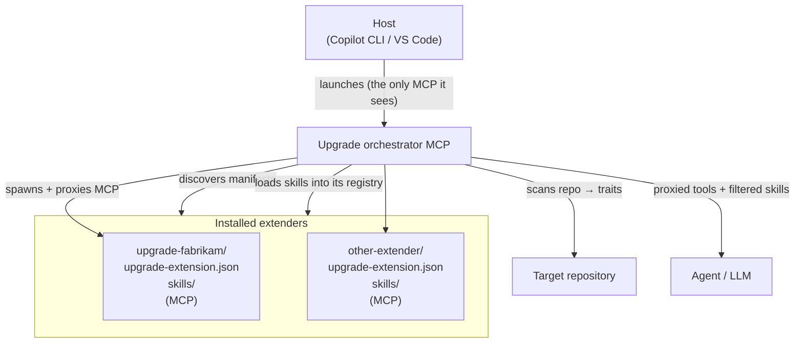

# 1. The extension model

This page explains how an extender plugs into the Upgrade agent. The model is
**host-agnostic**: the same manifest, skills, and tool surface work whether you
ship a Copilot CLI plugin or a VS Code extension. The host-specific packaging is
covered in docs [2](02-copilot-cli-plugin.md) and [3](03-vscode-extension.md).

## 1.1 Topology



**Key invariant.** The host launches **only the orchestrator**. Your extender's
MCP server is **never launched by the host directly** — the orchestrator
discovers your manifest, spawns your MCP as a child process, and proxies its
tools. This is why the manifest, not the host package, is the source of truth
for your extender.

## 1.2 What an extender contributes

| Surface | Required? | What it is |
|---------|-----------|------------|
| **Manifest** (`upgrade-extension.json`) | Yes | Identifies the folder as an extender; declares id/version, MCP launch, trait gates. |
| **Skills** (`skills/`) | Recommended | Markdown scenarios, on-demand guidance, and **scenario extensions** the agent follows. An extender can be skills-only. |
| **MCP server** | Optional | A process exposing tools the agent calls. Omit if your extender is skills-only. |
| **Sub-agents** (`agents/`) | Optional | Hidden `*.agent.md` worker agents the orchestrator dispatches by name. Each may declare **its own** `mcp-servers`. See [doc 8](08-sub-agents.md). |
| **Hooks** | Reserved | Folder reserved for a future hooks runtime. Not yet active. |

A useful extender is usually **skills + an MCP server**, but **skills-only**
extenders are fully supported — drop the `mcp` block from the manifest and ship
no MCP project.

Two skill shapes matter most in practice:

- A **scenario** — a workflow of your own the user can pick ([doc 4](04-skills.md)).
- A **scenario extension** — your rules injected into a workflow the
  orchestrator already owns ([doc 6](06-scenario-extensions.md)). If your
  technology shows up *inside* somebody else's migration, this is the surface
  you want.

## 1.3 The manifest: `upgrade-extension.json`

A single JSON file at the root of your extender folder. Minimal form:

```jsonc
{
  "id": "upgrade-fabrikam",
  "displayName": "Fabrikam Suite Upgrade",
  "version": "1.0.0"
}
```

Full form with an MCP and trait gating:

```jsonc
{
  "id": "upgrade-fabrikam",
  "displayName": "Fabrikam Suite Upgrade",
  "version": "1.0.0",
  "traits": ".NET|CSharp|VisualBasic|DotNetCore",
  "mcp": {
    "command": "dnx",
    "args": ["Fabrikam.Upgrade.Mcp", "--yes"]
  }
}
```

| Field | Required | Description |
|-------|----------|-------------|
| `id` | Yes | Globally unique, lowercase, hyphenated (`^[a-z][a-z0-9-]{2,63}$`). This is the value scenarios reference in `requires-extension`, and the prefix the orchestrator uses on tool-name collisions. |
| `displayName` | Yes | Human-readable name shown in diagnostics. |
| `version` | Yes | SemVer of your extender, independent of the orchestrator. |
| `mcp` | No | How to launch your MCP. Omit for skills-only extenders. See below. |
| `enabled` | No | Extender-level kill switch (default `true`). |
| `traits` | No | A trait expression gating the whole extender. Empty/omitted = always applies. See §1.5. |
| `skills` | No | Extra skill-root path(s) relative to the manifest, merged with the conventional `skills/` lookup. |
| `tools` | No | Per-tool gate overrides keyed by your bare tool names. |

> The full machine-readable schema is mirrored at
> [`docs/upgrade-extension.schema.json`](upgrade-extension.schema.json). Point your
> editor's JSON validation at it for IntelliSense.

### The `mcp` block

```jsonc
"mcp": {
  "command": "dnx",                        // launcher: dnx, npx, dotnet, node, …
  "args": ["Fabrikam.Upgrade.Mcp", "--yes"],     // passed verbatim to the child
  "workingDirectory": null                 // optional; ${pluginRoot} token allowed
}
```

`command` + `args` is whatever launches your MCP server over stdio — there is no
requirement to ship server code alongside the manifest. Common forms: `dnx`
(a published .NET tool), `npx -y <package>` (a published npm package), or a
direct `dotnet`/`node` invocation. Path arguments may use the `${pluginRoot}`
token, which the orchestrator replaces with your extender's folder at spawn
time.

## 1.4 Skills layout

By default the orchestrator looks for skills under your extender folder in this
order, **merging** every layer that exists:

```
<extender-root>/
├── upgrade-extension.json
├── skills/
│   ├── fabrikam-v4-upgrade/SKILL.md       # a scenario
│   ├── fabrikam-package-audit/SKILL.md    # on-demand guidance
│   └── fabrikam-controls-rules/SKILL.md   # a scenario extension (doc 6)
└── agents/
    └── fabrikam-dependency-validation.agent.md   # optional sub-agent (doc 8)
```

It also checks `upgrade/skills/` (a scoped layout some hosts use) and any path
you list in the manifest's `skills` field. Skill-id collisions across layers are
de-duplicated. See [doc 4](04-skills.md) for the SKILL.md format.

## 1.5 Traits and gating

The orchestrator **scans the target repository** on boot and produces a set of
**traits** — boolean facts about the technologies present. Some are coarse,
filename-level **discovery traits** (`DotNet`, `Containerized`,
`Azure`); others are finer **capability traits** surfaced by deeper
analysis (`.NET`, `CSharp`, `DotNetCore`, `DotNetFramework`). You use traits in
two places:

1. **Manifest `traits`** — gates whether your *entire extender* is spawned. The
   real .NET extender gates on `".NET|CSharp|VisualBasic|DotNetCore"`, so the
   orchestrator only spawns its MCP for an actual .NET solution. This sample
   uses the same gate.
2. **Skill `metadata.traits`** — gates whether an individual *skill* is offered
   to the agent.

Trait expressions support `|` (OR), `&` / `+` (AND), `!` (NOT), and parentheses,
and are case-insensitive — e.g. `"(.NET|CSharp|VisualBasic) & DotNetFramework"`.

The complete catalog of discoverable traits is in
[doc 5](05-skills-metadata-and-traits.md). Gating on the right traits is what
makes your content appear *at the right moment* and stay out of the way
otherwise.

## 1.6 Discovery & lifecycle (what the orchestrator does for you)

You don't write any of this — it's the contract the orchestrator fulfils:

1. The host launches the orchestrator when the user starts the Upgrade agent.
2. The orchestrator scans the repository and computes traits.
3. It discovers every installed extender by finding `upgrade-extension.json`
   manifests, then loads each extender's skills into its registry.
4. For each enabled extender that declares an `mcp` block, it spawns the MCP as
   a child process and proxies its tools — then surfaces those tools only while
   the extender's `traits` gate matches the resolved trait set (re-checked when
   a tool is called). `enabled: false` stops the extender from being spawned at
   all.
5. As the user works, the orchestrator filters skills and tools by trait and by
   the active scenario, so the agent sees a focused surface.

## 1.7 Bundling several extenders

A single host package can carry **multiple independent extenders**. Put each one
in its own self-contained `extenders/<name>/` folder (each with its own
`upgrade-extension.json` and `skills/`). The orchestrator discovers every nested
manifest. Keeping each extender self-contained means you can later split one out
into its own package by moving the folder — no other changes.

## Next

- Package for Copilot CLI → [doc 2](02-copilot-cli-plugin.md)
- Package for VS Code → [doc 3](03-vscode-extension.md)
- Write skills → [doc 4](04-skills.md)
- Extend a built-in scenario → [doc 6](06-scenario-extensions.md)
- Keep it small → [doc 7](07-instruction-size-and-tokens.md)
- Ship sub-agents → [doc 8](08-sub-agents.md)
