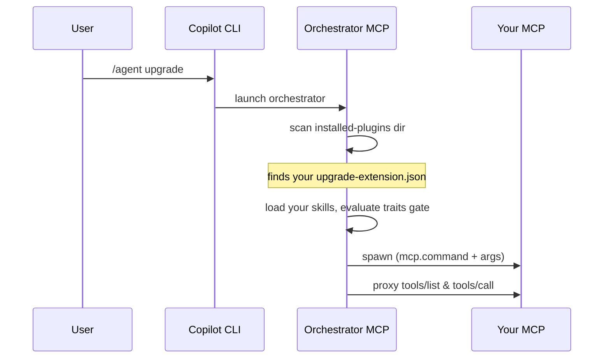

# 2. Packaging an extender as a Copilot CLI plugin

This page shows how to ship your extender as a **GitHub Copilot CLI plugin**.
The working example lives in
[`../../samples/copilot-cli-plugin/`](../../samples/copilot-cli-plugin/).

Read [doc 1](01-extension-model.md) first — it covers the manifest, skills, and
trait gating that are shared across hosts. This page only adds the CLI-specific
packaging.

## 2.1 Folder layout

```
copilot-cli-plugin/
├── plugin.json                 # Copilot CLI plugin metadata
├── upgrade-extension.json    # the extender manifest (see doc 1)
└── skills/
    ├── fabrikam-v4-upgrade/SKILL.md
    └── fabrikam-package-audit/SKILL.md
```

The plugin ships the manifest and skills. Your MCP server is **not** bundled
here — the manifest's `mcp` block only names a command (e.g. a published `dnx`
or `npx` package) that the orchestrator launches.

After the user installs the plugin, the CLI extracts it to a folder under its
installed-plugins directory. The orchestrator scans that directory, finds your
`upgrade-extension.json`, and takes over from there.

## 2.2 `plugin.json`

This is the **Copilot CLI** plugin manifest — install/list/categorize metadata.
It is *not* the extender manifest.

```jsonc
{
  "name": "upgrade-fabrikam",
  "version": "1.0.0",
  "description": "Fabrikam Suite Upgrade — sample modernization extender for the Fabrikam .NET component suite.",
  "author": { "name": "Fabrikam" },
  "license": "MIT",
  "keywords": ["modernize", "copilot", "upgrade", "dotnet", "nuget"]
}
```

### Do **not** declare an `mcpServers` block here

Under the orchestrator model, the CLI must **not** launch your MCP — the
orchestrator does. If `plugin.json` also declared an `mcpServers` entry for your
extender, the CLI would spawn it in parallel with the orchestrator's child,
producing a duplicate. Leave `mcpServers` out entirely; the orchestrator learns
how to launch your MCP from the `mcp` block in `upgrade-extension.json`.

### Do **not** ship a visible agent file

Only the orchestrator should appear in the CLI's `/agent` list. Either ship no
custom-agent file at all (recommended for an extender), or mark any agent file
`hidden`. The sample ships none.

## 2.3 How discovery works on the CLI



There is no per-plugin wiring you need to do. Dropping a folder with a valid
`upgrade-extension.json` into the installed-plugins location is enough for the
orchestrator to pick it up on its next launch.

## 2.4 Skills-only plugins

If your extender contributes only skills, remove the `mcp` block from
`upgrade-extension.json`. The plugin then ships just `plugin.json`,
`upgrade-extension.json`, and `skills/`. The orchestrator loads the skills and
never tries to spawn an MCP.

## 2.5 Local development loop

1. Get your MCP server runnable by a command. Either:
   - publish it (e.g. a .NET tool consumed via `dnx`, or an npm package consumed
     via `npx`) and reference that command in `mcp.command`/`mcp.args`, or
   - point `mcp.command`/`mcp.args` at a local invocation
     (`dotnet run --project <abs-path>`, `node <abs-path>`, …) for a fast inner
     loop.
2. Place the plugin folder where the CLI's orchestrator scans for installed
   plugins (your host's installed-plugins directory).
3. Restart the CLI and run `/agent upgrade`. Confirm your tools appear and your
   scenario shows up when the repository matches your trait gate.

> Tip: keep the published command (production launcher) in the checked-in
> manifest, and only rewrite it to a local form in a local, uncommitted copy.
> That keeps the manifest correct for users while letting you
> iterate.

## 2.6 Checklist

- [ ] `plugin.json` has a unique `name`, no `mcpServers`, no visible agent file.
- [ ] `upgrade-extension.json` `id` matches `plugin.json` `name` and is unique.
- [ ] `mcp.command` resolves on the user's PATH after install (or the block is
      omitted for skills-only).
- [ ] Skills gate on the right traits (see [doc 5](05-skills-metadata-and-traits.md)).
- [ ] Tool names are unique within your extender and ≤ ~40 chars.
