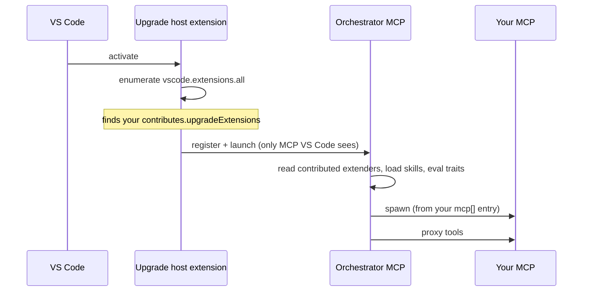

# 3. Packaging an extender as a VS Code extension

This page shows how to ship your extender as a **VS Code extension**. The
working example lives in
[`samples/vscode-extension/`](../samples/vscode-extension/).

Read [doc 1](01-extension-model.md) first for the manifest, skills, and trait
gating shared across hosts. This page only adds the VS Code-specific packaging.

## 3.1 Folder layout

```
vscode-extension/
├── package.json                # VS Code extension manifest + contribution
├── extension.js                # a no-op activation entry point
├── .vscodeignore
├── upgrade-extension.json     # the extender manifest (see doc 1)
└── skills/
    ├── fabrikam-v4-upgrade/SKILL.md          # a scenario
    ├── fabrikam-package-audit/SKILL.md       # on-demand guidance
    └── fabrikam-controls-rules/              # a scenario extension (doc 6)
        ├── SKILL.md
        └── scopes/{assessment,planning}.md
```

Your VSIX is a **data contribution**: it declares where your manifest, skills,
and MCP launch instructions live, then gets out of the way. It does **not**
register an MCP server with VS Code — only the orchestrator does that.

## 3.2 The `contributes.upgradeExtensions` contribution point

This is the heart of the VS Code packaging. Declare one entry per extender:

```jsonc
{
  "name": "upgrade-fabrikam",
  "displayName": "Fabrikam Suite Upgrade",
  "publisher": "fabrikam",
  "version": "1.0.0",
  "engines": { "vscode": "^1.95.0" },
  "activationEvents": [],
  "main": "./extension.js",
  "contributes": {
    "upgradeExtensions": [
      {
        "id": "upgrade-fabrikam",
        "manifest": "./upgrade-extension.json",
        "skills": "./skills",
        "mcp": [
          {
            "label": "Fabrikam-Upgrade",
            "transport": "dnx",
            "package": "Fabrikam.Upgrade.Mcp",
            "prerelease": true
          }
        ]
      }
    ]
  }
}
```

| Field | Required | Description |
|-------|----------|-------------|
| `id` | Yes | Must equal the `id` in `upgrade-extension.json`. |
| `manifest` | No | Path to `upgrade-extension.json` relative to the VSIX root. Defaults to `./upgrade-extension.json`. |
| `skills` | No | Skills directory relative to the VSIX root. Defaults to `./skills`. |
| `hooks` | No | Reserved (future). Defaults to `./hooks`. |
| `mcp[]` | Yes if you ship an MCP | One or more launch instructions; the orchestrator picks the first it can run. |

### `mcp[]` transports

| Transport | Shape | Use when |
|-----------|-------|----------|
| `dnx` | `{ label, transport: "dnx", package, prerelease?, source? }` | Your MCP ships as a published .NET tool. Resolved via `dotnet dnx <package>`. |
| `exec` | `{ label, transport: "exec", command, args? }` | Your MCP is any other process. Use `${extensionPath}` to point inside the installed VSIX. |

Example `exec` entry for a local dev loop:

```jsonc
{
  "label": "Fabrikam-Upgrade-Dev",
  "transport": "exec",
  "command": "dotnet",
  "args": ["run", "--project", "${extensionPath}/../my-mcp-server", "--"]
}
```

> The `exec` `command` can be anything that speaks MCP over stdio (`node`,
> `python`, a built binary, …). No MCP server code needs to live inside the VSIX
> — point `exec`/`dnx` at wherever your server actually runs.

## 3.3 Recommended `package.json` metadata

- **`activationEvents: []`** — your extension never needs to activate. VS Code
  reads the contribution point at host startup; no JS runs.
- **No `extensionDependencies`** — the orchestrator host extension loads
  independently. Declaring a dependency can prevent your VSIX from loading in
  some development configurations.
- **A no-op `extension.js`** is all you need:

  ```js
  exports.activate = function () { /* no-op */ };
  exports.deactivate = function () { /* no-op */ };
  ```

## 3.4 How discovery works in VS Code



The Upgrade host extension collects every contributed extender, hands the list
to the orchestrator, and the orchestrator does the rest. VS Code never launches
your MCP directly — only the orchestrator appears in the VS Code MCP UI.

## 3.5 A note on tool names in VS Code

VS Code Copilot Chat namespaces every MCP tool it registers as
`mcp_<serverLabel>_<toolName>`. Because your tools ride through the
orchestrator, they inherit the orchestrator's label — a tool you expose as
`detect_fabrikam_packages` reaches the model as
`mcp_modernization_detect_fabrikam_packages`. The chat UI strips the prefix for
display. This is a VS Code presentation detail you don't control; **don't rename
your tools to work around it.** Skill prose should refer to the bare tool name —
every host resolves it.

## 3.6 Multiple extenders & self-discovery

`contributes.upgradeExtensions` is an array, so one VSIX can contribute several
extenders — point each entry at its own `./extenders/<name>/upgrade-extension.json`
and `./extenders/<name>/skills`. Keep each folder self-contained so it can later
be split into its own VSIX by moving the folder and its array entry.

## 3.7 Sub-agents in VS Code

If your extender ships sub-agents ([doc 8](08-sub-agents.md)), VS Code needs two
things rather than one, because **it does not auto-discover agent files**:

1. The `*.agent.md` files must be staged into the extension's flat `prompts/`
   folder — not left nested beside `upgrade-extension.json`.
2. Each one must be listed in `contributes.chatAgents` in `package.json`.

The rest mostly matches the CLI: you must declare `user-invocable: false`
yourself, names must be globally unique, and an agent's own `mcp-servers` block
is staged verbatim with no `${...}` substitution. One VS Code difference worth
knowing: an agent-local `mcp-servers` block is **not launched by VS Code today**
— it is honoured by the Copilot CLI agent runtime. Don't build a VS Code-only
sub-agent around its own server. This sample ships no sub-agent; the Copilot CLI
sample does.

## 3.8 Checklist

- [ ] `contributes.upgradeExtensions[].id` matches `upgrade-extension.json` `id`.
- [ ] `activationEvents` is empty and `extension.js` is a no-op.
- [ ] No `extensionDependencies`.
- [ ] An `mcp[]` entry resolves on the user's machine (published `dnx` package
      for release; `exec` for local dev).
- [ ] Skills gate on the right traits (see [doc 5](05-skills-metadata-and-traits.md)).
- [ ] Any scenario extension declares `scope` — without it, it is never used
      (see [doc 6](06-scenario-extensions.md)).
- [ ] Any sub-agent is staged to `prompts/` **and** listed in
      `contributes.chatAgents`.
- [ ] Content is sized against [doc 7](07-instruction-size-and-tokens.md).
