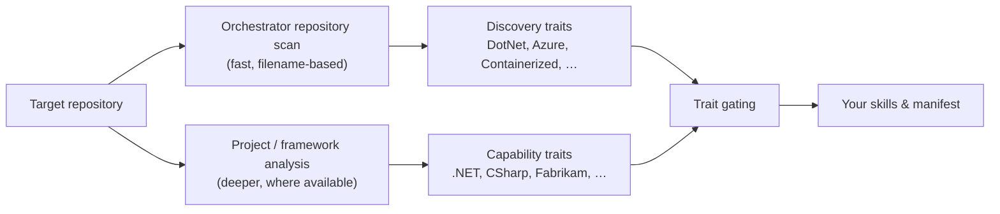

# 5. Skills metadata & known traits

This is the reference for **traits** — the facts the Upgrade orchestrator learns
about a repository, and which you reference in skill and manifest metadata so
your content surfaces **at the right moment** and stays out of the way
otherwise.

Read [doc 4](04-skills.md) for the skill metadata format first. This page
focuses on *what trait values exist* and *how to use them*.

## 5.1 Where traits come from

Traits are produced by **discovery** and then made available to gating:



There are **two families** of trait names you can gate on:

1. **Discovery traits** — emitted by the orchestrator's repository scan that
   runs on every boot. Fast, filename-based, language- and ecosystem-level.
   These are the canonical, stable names listed in §5.3.
2. **Capability traits** — finer-grained technology tags surfaced by deeper
   project/framework analysis when the relevant extender is present (for
   example the .NET extender contributes `.NET`, `CSharp`, `DotNetFramework`).
   Use these in scenario gating when you need framework-level precision.

> **Rule of thumb.** Gate your **manifest** on the broad platform trait(s) for
> your ecosystem — the real .NET extender uses
> `.NET|CSharp|VisualBasic|DotNetCore`. Coarse **discovery traits** (§5.3) like
> `DotNet` also work for a manifest gate and are cheap. Use narrower
> **capability traits** (§5.4) — e.g. `DotNetFramework`, `WebForms` — for
> scenario-level precision.

## 5.2 How to use traits

### In the manifest (`upgrade-extension.json`)

Gate whether your extender's *tools and skills are surfaced* (this is the real
.NET extender's gate, which the sample reuses):

```jsonc
{ "id": "upgrade-fabrikam", "displayName": "...", "version": "1.0.0",
  "traits": ".NET|CSharp|VisualBasic|DotNetCore" }
```

An extender whose traits don't match still gets spawned — it just contributes
nothing, so none of its tools or skills reach the model. To stop it being
spawned at all, use `enabled: false`. See [doc 1 §1.5](01-extension-model.md#15-traits-and-gating).

### In a skill (`SKILL.md`)

Gate whether an individual skill is offered:

```yaml
metadata:
  traits: .NET|CSharp|VisualBasic|DotNetCore
```

### In a scenario's `scenarioTraitsSet`

Characterize the scenario with extra traits used when matching it to a
repository:

```yaml
metadata:
  discovery: scenario
  traits: .NET|CSharp|VisualBasic|DotNetCore
  scenarioTraitsSet: [.NET]
```

### Trait expression grammar

| Operator | Meaning | Example |
|----------|---------|---------|
| `X` | trait present | `DotNet` |
| `X \| Y` | OR | `DotNet \| NodeJs` |
| `X & Y` or `X + Y` | AND | `DotNet & Containerized` |
| `!X` | NOT | `DotNet & !Go` |
| `( … )` | grouping | `(DotNet \| NodeJs) & Azure` |

Trait names and operators are **case-insensitive**. An empty/omitted expression
means "always applies".

## 5.3 Discovery trait catalog

The orchestrator contributes traits from three sources. All names below are the
**real, exact** strings the host emits — trait matching is case-insensitive, but
these are the canonical spellings.

### Repository scan traits

Emitted by the orchestrator's repository scan. These are the stable,
host-agnostic names you can rely on for gating.

| Category | Traits |
|----------|--------|
| **Language / ecosystem** | `DotNet`, `NodeJs`, `Python`, `Java`, `Go`, `Rust`, `Ruby`, `Php`, `Cpp`, `Swift`, `Dart` |
| **Per-language** | `CSharp`, `VisualBasic`, `FSharp`, `Kotlin`, `Scala`, `JavaScript`, `TypeScript` |
| **Build systems** | `Maven`, `Gradle`, `Sbt`, `CMake`, `Cargo` |
| **.NET / legacy markers** | `DotNetWeb`, `Wcf` |
| **JVM / mobile / Python** | `Android`, `Django`, `Jupyter` |
| **Containers & orchestration** | `Containerized`, `Helm`, `Kubernetes`, `OpenShift` |
| **Cloud targets** | `Azure`, `Aws`, `Gcp`, `Cloudflare`, `Terraform`, `Pulumi`, `Iac` |
| **Web servers** | `Nginx`, `Apache`, `Tomcat`, `Rails` |
| **CI providers** | `GitHubActions`, `AzurePipelines`, `GitLabCi`, `Jenkins`, `CircleCi`, `TravisCi`, `BitbucketPipelines`, `TeamCity` |

### Host / caller traits

Exactly one caller trait is injected based on which host launched the
orchestrator:

| Trait | Host |
|-------|------|
| `CopilotCli` | Copilot CLI |
| `VsCode` | VS Code extension |
| `CopilotCodingAgent` | Copilot coding agent |
| `VS` | Visual Studio |

The Visual Studio host additionally derives traits from the open solution rather
than from the repository scan, including `CMake`, `DotNetFramework`, and
`WebForms`, plus the loaded projects' own capabilities (e.g. `CSharp`, `VB`).

> **.NET baseline.** When launched from the Copilot CLI the host currently also
> seeds every session with `.NET`, `CSharp`, `VisualBasic`, `DotNetCore` as a
> .NET-tooling default. Treat these as host defaults, not as repository-derived
> evidence — don't rely on them to prove a repo actually contains .NET code.

Notes:

- The repository-scan traits come from a **filename-only** scan — they tell you a
  technology is *present*, not the version or framework in use.
- The scan does not read file contents in its default mode, so it does **not**
  emit per-framework traits like "uses Django 4" — pair a discovery trait with
  your own MCP tool when you need that precision (your tool runs once your
  extender is active).
- New discovery traits may be added over time; existing names are stable.

## 5.4 Capability traits (framework-level)

When a domain extender or the first-party .NET tooling performs deeper analysis,
it surfaces finer technology tags. Scenario skills gate on these for precision.
The names below are **real** capability traits recognized by the first-party .NET
tooling — gate on them directly when your extender targets .NET.

| Group | Traits |
|-------|--------|
| Platform | `.NET`, `DotNetCore`, `DotNetFramework` |
| Language | `CSharp`, `VisualBasic` |
| .NET web / app frameworks | `WebForms`, `Wcf`, `WinForms`, `WPF`, `Maui`, `WinUI` |
| Tooling | `VisualStudio`, `VSSDK` |
| Cloud / serverless | `MigrateToAzure`, `AzureFunctions` |

This sample's `fabrikam-v4-upgrade` scenario follows the same package-migration
shape as `newtonsoft-json-migration` / `sqlclient-migration`, so it reuses their
gate: `traits: .NET|CSharp|VisualBasic|DotNetCore`, `scenarioTraitsSet: [.NET]`.

If you extend a **different** ecosystem, define and document your own capability
vocabulary the same way — declare the tags in your scenarios' `traits` /
`scenarioTraitsSet`, surface them from your MCP analysis, and document them so
downstream scenarios can interoperate.

## 5.5 Putting it together — worked example

A Fabrikam v3 → v4 package migration scenario:

```yaml
---
name: fabrikam-v4-upgrade
description: Migrate a .NET solution from the Fabrikam v3 suite to v4.
requires-extension: upgrade-fabrikam
metadata:
  discovery: scenario
  importance: high
  weight: 9000
  traits: .NET|CSharp|VisualBasic|DotNetCore   # capability traits — gates availability
  scenarioTraitsSet: [.NET, Fabrikam]                     # characterizes the scenario
---
```

- `traits: .NET|CSharp|VisualBasic|DotNetCore` ensures the scenario is only
  offered for an actual .NET solution — so it surfaces at the right moment and is
  invisible elsewhere.
- `scenarioTraitsSet` adds the tag the orchestrator uses to match this scenario
  against the repository's overall character.
- `weight` orders it ahead of lower-weight comparable scenarios.

## 5.6 Checklist for "right moment" gating

- [ ] Manifest gated on the broad platform trait(s) for your ecosystem
      (e.g. `.NET|CSharp|VisualBasic|DotNetCore`).
- [ ] Each lazy skill has a **specific `description`** and a `traits` gate.
- [ ] Each scenario sets `traits` (availability) **and** `scenarioTraitsSet`
      (characterization).
- [ ] You use `!` to exclude repositories your content shouldn't touch.
- [ ] Framework-level precision your scan can't see is provided by an MCP tool,
      called only after activation.
