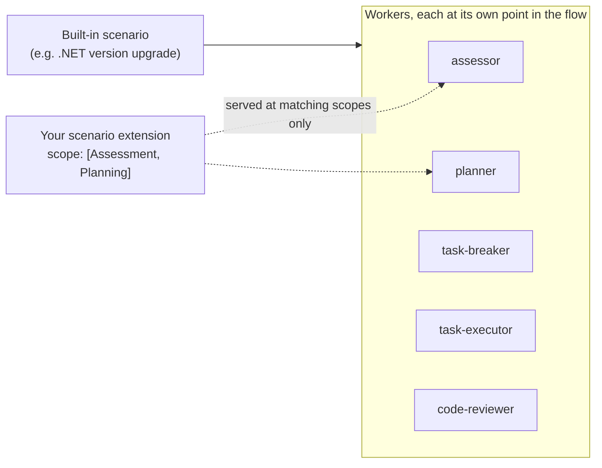

# 6. Scenario extensions

A **scenario extension** adds your rules to a scenario the orchestrator already
owns, instead of defining a workflow of its own.

Use it when you own a technology that appears **inside somebody else's
migration** — a control library, a package family, an API surface. Built-in
scenarios know only platform defaults; everything specific to your product has
to arrive this way.



> **Scenario vs. scenario extension.** A *scenario* (`discovery: scenario`,
> [doc 4](04-skills.md)) is a workflow the user can pick. A *scenario extension*
> is never user-selectable, never appears in agent skill lists, and is never
> returned by skill search. It exists only to be injected into a scenario that is
> already running.

## 6.1 Declaring one

A scenario extension is an ordinary `SKILL.md` with `discovery: scenarioExtension`:

```yaml
---
name: fabrikam-controls-rules
description: >
  Migration rules for Fabrikam WinForms controls during a framework upgrade.
metadata:
  discovery: scenarioExtension
  extends-scenario: [dotnet-version-upgrade]
  traits: .NET|CSharp|VisualBasic
  order: 100
  scope: [Assessment, Planning, IntegrityReview]
  scopeInstructions:
    Assessment: scopes/assessment.md
    Planning: scopes/planning.md
---

Fabrikam controls ship in `Fabrikam.Windows.Forms`. Versions before 8.0 are not
supported on .NET 8+ and must be replaced, not retargeted.
```

| Field | Required | Meaning |
|-------|----------|---------|
| `discovery: scenarioExtension` | **Yes** | Classifies the skill. Case-insensitive. Only `none`, `preload`, `lazy`, `system`, `scenario`, `scenarioExtension` are accepted — anything else counts as a typo. Exclusive: combining it with another mode (`scenarioExtension, preload`) collapses back to `scenarioExtension`, so extension content can never also be preloaded or selected as a scenario. |
| `scope` | **Yes** | *Where in the flow* the extension applies. String or list. **Omitting it means the extension is never used** — see §6.3. |
| `extends-scenario` | No | Scenario id(s) it applies to. String or list. **Omit to apply to every scenario** — the right shape for cross-cutting guidance such as review rules. |
| `scopeInstructions` | No | Map of scope → file path, relative to the skill folder. Chooses *what* is served at a scope; never turns one on. See §6.4. |
| `traits` | No | Standard trait gate, ANDed with your manifest's `traits`. See [doc 5](05-skills-metadata-and-traits.md). |
| `order` | No | Ascending presentation order; lower is served first. **Omitted sorts last.** Ties break on extender id, then skill name. |

`name` and `description` are the usual top-level fields. `requires-extension` is
for *scenarios* and has no meaning here.

> **Keep the YAML shapes intact.** `scope` and `extends-scenario` accept a
> scalar **or a list**; `scopeInstructions` must be a **mapping**. Don't
> pipe-join the lists (`scope: Assessment|Planning` is one scope named
> `Assessment|Planning`) and don't stringify the map.

## 6.2 The scope vocabulary

Each worker in a scenario asks for the extension content relevant to *its* point
in the flow. Your `scope` decides which of those requests you answer.

| Scope | Asked by | Put here |
|-------|----------|----------|
| `Assessment` | the assessment workers | Detection rules — deprecated packages, unsupported versions, what to flag and how to judge it. |
| `Planning` | the planner | Ordering constraints, prerequisites, and **upgrade options** the user should be asked about (§6.6). |
| `TaskBreakdown` | the task-breaker | How work on your technology should be split into tasks. |
| `Execution` | the execution workers, including error handling | The migration mechanics — API replacements, code patterns, before/after snippets. |
| `IntegrityReview` | the code-reviewer | Correctness rules for reviewing the resulting change. |
| `Any` | every scope | Guidance that genuinely applies throughout. **Must stand alone** — listed next to named scopes it would make them meaningless, so the named ones win and the `Any` is dropped with a warning. A `scope` value only, never a `scopeInstructions` key. |

Scopes are **free-form strings**, matched case-insensitively, and more than one
worker can ask for the same one — `Execution` content is served both when work
is applied and when a failure is fixed. Write for the scope's *purpose*, not for
one imagined caller. A scope nothing asks for is inert, and starts working if
that scope is wired later.

Pick the narrowest set that is true. Content is served **per request, not once
per run** — `Execution` is requested on every task — so a broadly-scoped
extension is loaded many times over and spends budget every time
([doc 7](07-instruction-size-and-tokens.md)).

## 6.3 `scope` and `extends-scenario` treat "absent" differently

This trips people up, and the difference is deliberate:

| Field | Omitted means |
|-------|---------------|
| `extends-scenario` | **Every scenario.** It is a *filter*; removing the filter widens the match. |
| `scope` | **Never used.** It is not a filter — it is the declaration that the extension applies anywhere at all. Nothing to apply to means nothing happens. |

If you want "everywhere" behaviour for scope, write it out: `scope: Any`.

### Finding the scenario id to target

`extends-scenario` matches the scenario's **id**. A name that matches nothing
fails silently — your skill is valid, it just never applies — so don't guess:

- **Copy it from the scenario you're extending.** Its own skill declares the
  authoritative spelling.
- **Prove it before you invest.** Ship one obvious line at `Assessment` and
  confirm it appears in a real run. A wrong id and a wrong `scope` look
  identical from outside.
- **Omit it if your guidance is cross-cutting.** Review rules that hold for any
  upgrade don't need an id, and omitting beats pinning the wrong one.

> The samples use `dotnet-version-upgrade` as an illustrative placeholder.
> Verify the id in your own environment.

## 6.4 `scopeInstructions` — different content at different points

One skill can serve a different file at each scope, so a worker only pays for
the part that concerns it:

```
skills/fabrikam-controls-rules/
├── SKILL.md              # frontmatter + shared body (the fallback)
└── scopes/
    ├── assessment.md     # detection rules
    └── planning.md       # ordering + the upgrade option
```

Rules:

- It **never turns a scope on.** A key naming a scope missing from `scope` is
  never served — you're filtered out at that scope before content is resolved,
  so your root body doesn't appear there either. The exception is `scope: Any`,
  which already applies everywhere and may map any scope.
- **`Any` is not a valid key** — it is a `scope` value only. Keyed entries are
  ignored with a warning.
- **There is no catch-all key.** An unmapped scope already gets your `SKILL.md`
  body. Put shared guidance there, or map the same file to several scopes.
- Paths are **relative to the skill folder**; paths that escape it are rejected.
- A missing, unreadable, or empty file is **skipped with a warning** and the
  rest of that scope is still served. Only when **none** of a scope's files can
  be read does it **fall back to your root body** — a mistyped path must not
  leave you worse off than mapping nothing. An extension is dropped only when it
  has no text anywhere.
- A scope mapped to **several** files is concatenated, which makes truncation
  non-resumable (§6.5). Map **one file per scope** if you want it resumable.

## 6.5 How the content reaches the agent

Each worker pulls what it needs, when it needs it. You wire nothing, and "no
extensions apply" is a **success**, not an error. The run tracks which scenario
is active; you never pass a scenario id or register a hook.

Your content arrives wrapped:

```text
<scenario_extension name="…" scope="…" path="…">
…content…
</scenario_extension>
```

The response is a **shared budget**: preamble, wrappers and every matching
extension must fit together. It is divided **by ascending need**, so an
extension smaller than its equal share releases the remainder. Declaration order
never decides who gets trimmed, and no extension can starve the rest.

Hence the rule this whole section exists to support: **keep each scope's content
small and scoped to the action it serves.** You share space with every other
extender that matched, so content sized for a generous allowance arrives cut in
half.

An extension that doesn't fit gets its **leading whole lines plus a pointer** —
never a silent cut. The agent must then read the remainder in chunks, which
costs a tool call and costs you the certainty that it bothered:

```text
<scenario_extension name="…" scope="…" path="…"
    delivery="partial" shown-lines="…" total-lines="…">
…leading lines…
[Truncated at line <shown> of <total>. Continue with read("…", offset=<shown>), or search it for
the package or API you need.]
</scenario_extension>
```

If not even one line fits, the extension degrades to a body-less **reference**
naming the file, so the worker still learns it exists and can read it:

```text
<scenario_extension name="…" scope="…" path="…" delivery="reference" total-lines="…">
[Not included: too large to fit. Use read("…") for the package or API you need.]
</scenario_extension>
```

When the budget is exhausted past even that, the response ends with a **notice
that further extensions were omitted**. That is the worst case, and the one to
design against: an extension you cannot see is an extension that cannot
influence the run.

Three consequences for you as an author:

1. **Cuts land on line boundaries**, so a partial table can't read as a complete
   one, and the resume offset is exact.
2. **A complete block carries no markers.** Their presence *is* the signal that
   more exists.
3. **Put the decisive content first.** A guardrail row ("do not infer a policy
   for a package not listed here") belongs *above* the table it guards, so it
   survives a partial delivery.

See [doc 7](07-instruction-size-and-tokens.md) for sizing guidance.

## 6.6 Contributing an upgrade option (`Planning`)

Planning content may include an `## Upgrade Option` section carrying a
`**Plan impact**:` line. The planner treats a contributed option like a
first-party one: it is evaluated at the planning gate, listed under
`## Upgrade Options` in the plan, and attributed to its source.

```markdown
## Upgrade Option

**Fabrikam control pack** — choose `Modern` (default), `Compat`, or `None`.
All three move to `Fabrikam.Windows.Forms` 8.x, which is mandatory on .NET 8+.

**Plan impact**: `Compat` also adds the compatibility shim, which keeps the v3
designer surface on top of 8.x so designer files need no regeneration;
`Modern` omits the shim and requires them to be regenerated.
```

Use this for a decision only the user can make — and note that every option
still satisfies the rule the extension exists to enforce. An option that reads
as a way to *opt out* of your guardrail is a bug: the scope file is served
instead of your root body, so the planner may never see the rule stated
elsewhere.

## 6.7 Rules and boundaries

- **Extension guidance is additive, but additive is not powerless.** It cannot
  override safety rules, the user's explicit instructions, or replace the
  scenario's own. Within those limits, Planning-scope guidance *may* add or
  reorder tasks, constrain the strategy, or contribute an upgrade option — that
  is what the scope is for.
- **`order` does not arbitrate conflicts.** It fixes the sequence blocks are
  served in, nothing more. Where two extenders give incompatible instructions
  for the same code, the agent should surface the conflict as a decision, not
  take whichever sorted last. If your guidance only holds under conditions, say
  so in the text.
- **A block never says who packaged it.** It carries the skill's name and source
  path, not your brand. Say it in the body if it matters.
- **Your `Assessment` guidance can shape the report.** State what you want
  recorded and where. Don't name a path inside the report's own `assessment/`
  folder — the orchestrator owns and rewrites that tree. A file of your own
  belongs beside the report.
- **A skill folder is trusted content**, but only its own files: mapped paths
  that escape it are rejected.

## 6.8 When it doesn't work

Authoring mistakes **fail quietly by design** — a broken extension goes inert
rather than derailing somebody else's upgrade. Good for users, awkward for you:
nothing crashes, your content simply never appears.

Each of these is logged with the skill name, so raise the host's log verbosity
and search for your skill's `name`. If you can't reach the logs, bisect: reduce
the skill to one scope and a short literal body with no `scopeInstructions`,
confirm that appears, then add pieces back.

| Symptom | Likely cause |
|---------|--------------|
| Never served anywhere | No `scope` declared. It does **not** default to `Any`. |
| Never served, `scope` looks right | `extends-scenario` names a scenario that doesn't exist — check the spelling against the scenario you mean to extend. |
| Served everywhere, unexpectedly | `extends-scenario` omitted — that means *every* scenario. |
| Served at some scopes, not others | A `scopeInstructions` key names a scope missing from `scope`. The map never turns a scope on (unless you declared `scope: Any`). |
| A `scopeInstructions` entry is ignored entirely | It is keyed `Any`, which is a `scope` value, not a key. |
| `Any` seems ignored | `Any` was listed alongside named scopes; the named ones win and `Any` is dropped with a warning. |
| Your root body appears where you mapped a file | *Every* file mapped to that scope was missing, empty, unreadable, or escaped the skill folder, so the scope fell back to the body. |
| Part of a multi-file scope is missing | One mapped file failed and was skipped; the rest were still served. The warning names it. |
| Appeared in skill search or an agent list | It isn't classified as an extension. Check `discovery`. |
| Content ends mid-document, or a block has no body | Partial or reference delivery — your content didn't fit. Move the decisive material to the top and see [doc 7](07-instruction-size-and-tokens.md). |

> Declaring `extends-scenario`, `scope` or `scopeInstructions` *without* a valid
> `discovery` — absent, blank, or misspelled — is tolerated: the shape says
> plainly what the skill is, so it is still classified as an extension, and the
> bad value is logged. For any *other* skill, an unparseable `discovery` fails
> closed and matches no discovery query at all. Don't lean on the rescue — it is
> a safety net, not a
> second way to declare an extension. Write `discovery: scenarioExtension`.

## Next

- [Instruction size & token budget](07-instruction-size-and-tokens.md) — how big
  your content should be, and why.
- [Extender sub-agents](08-sub-agents.md) — shipping your own worker agents.
