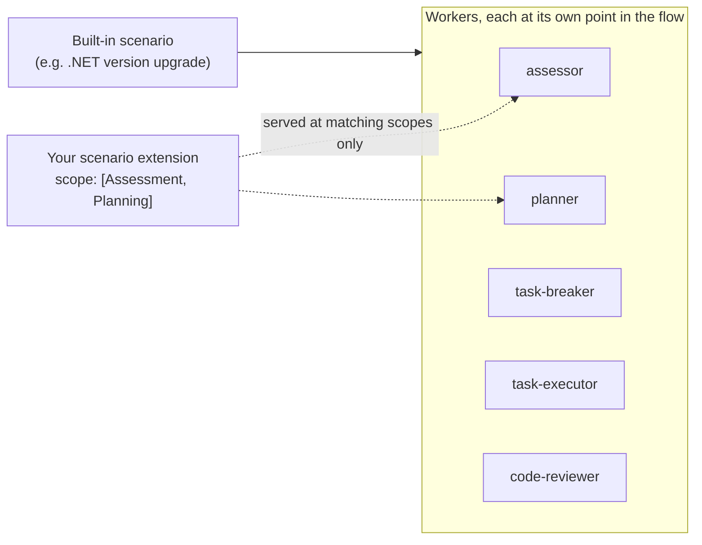

# 6. Scenario extensions

A **scenario extension** is a skill that *adds to a scenario the orchestrator
already owns*, instead of defining a workflow of its own.

This is the surface to use when you own a technology that appears **inside
somebody else's migration** — a control library, a package family, an API
surface. The orchestrator's built-in scenarios (for example, a .NET version
upgrade) only know platform defaults. Everything you know about *your* product —
your deprecations, your replacements, your support policy — has to arrive as a
scenario extension.



> **Scenario vs. scenario extension.** A *scenario* (`discovery: scenario`,
> [doc 4](04-skills.md)) is a workflow the user can pick. A *scenario extension*
> is never user-selectable, never appears in agent skill lists, and is never
> returned by skill search. It exists only to be injected into a scenario that is
> already running.

## 6.1 Declaring one

A scenario extension is an ordinary `SKILL.md` with `discovery: scenarioExtension`:

```yaml
---
name: fabrikam-controls-rules
description: >
  Migration rules for Fabrikam WinForms controls during a framework upgrade.
metadata:
  discovery: scenarioExtension
  extends-scenario: [dotnet-version-upgrade]
  traits: WindowsForms
  order: 100
  scope: [Assessment, Planning, IntegrityReview]
  scopeInstructions:
    Assessment: scopes/assessment.md
    Planning: scopes/planning.md
---

Fabrikam controls ship in `Fabrikam.Windows.Forms`. Versions before 8.0 are not
supported on .NET 8+ and must be replaced, not retargeted.
```

| Field | Required | Meaning |
|-------|----------|---------|
| `discovery: scenarioExtension` | **Yes** | Classifies the skill. Case-insensitive. Only `none`, `preload`, `lazy`, `system`, `scenario`, `scenarioExtension` are accepted — anything else counts as a typo. Exclusive: combining it with another mode (`scenarioExtension, preload`) collapses back to `scenarioExtension`, so extension content can never also be preloaded or selected as a scenario. |
| `scope` | **Yes** | *Where in the flow* the extension applies. String or list. **Omitting it means the extension is never used** — see §6.3. |
| `extends-scenario` | No | Scenario id(s) it applies to. String or list. **Omit to apply to every scenario** — the right shape for cross-cutting guidance such as review rules. |
| `scopeInstructions` | No | Map of scope → file path, relative to the skill folder. Chooses *what* is served at a scope; never turns one on. See §6.4. |
| `traits` | No | Standard trait gate, ANDed with your manifest's `traits`. See [doc 5](05-skills-metadata-and-traits.md). |
| `order` | No | Ascending presentation order; lower is served first. **Omitted sorts last.** Ties break on extender id, then skill name. |

`name` and `description` are the usual top-level fields. `requires-extension` is
for *scenarios* and has no meaning here.

> **Keep the YAML shapes intact.** `scope` and `extends-scenario` accept a
> scalar **or a list**; `scopeInstructions` must be a **mapping**. Don't
> pipe-join the lists (`scope: Assessment|Planning` is one scope named
> `Assessment|Planning`) and don't stringify the map.

## 6.2 The scope vocabulary

Each worker in a scenario asks for the extension content relevant to *its* point
in the flow. Your `scope` decides which of those requests you answer.

| Scope | Asked by | Put here |
|-------|----------|----------|
| `Assessment` | the assessor | Detection rules — deprecated packages, unsupported versions, what to flag and how to judge it. |
| `Planning` | the planner | Ordering constraints, prerequisites, and **upgrade options** the user should be asked about (§6.6). |
| `TaskBreakdown` | the task-breaker | How work on your technology should be split into tasks. |
| `Execution` | the task-executor | The migration mechanics — API replacements, code patterns, before/after snippets. |
| `IntegrityReview` | the code-reviewer | Correctness rules for reviewing the resulting change. |
| `Any` | every scope | Guidance that genuinely applies throughout. **Must stand alone** — listed next to named scopes it would make them meaningless, so the named ones win and the `Any` is dropped with a warning. A `scope` value only, never a `scopeInstructions` key. |

Scopes are **free-form strings**, matched case-insensitively. A scope nothing
asks for is simply inert — it costs nothing, and it starts working if that scope
is wired later. The table above is the set wired today.

Pick the narrowest set that is true. Content is served **per request, not once
per run**: a worker asks at the moment it needs it, and some workers run
repeatedly — `Execution` is requested on every task. A broadly-scoped extension
is therefore loaded many times over a single scenario, and spends budget every
time (see [doc 7](07-instruction-size-and-tokens.md)).

## 6.3 `scope` and `extends-scenario` treat "absent" differently

This trips people up, and the difference is deliberate:

| Field | Omitted means |
|-------|---------------|
| `extends-scenario` | **Every scenario.** It is a *filter*; removing the filter widens the match. |
| `scope` | **Never used.** It is not a filter — it is the declaration that the extension applies anywhere at all. Nothing to apply to means nothing happens. |

If you want "everywhere" behaviour for scope, write it out: `scope: Any`.

## 6.4 `scopeInstructions` — different content at different points

One skill can serve a different file at each scope, so a worker only pays for
the part that concerns it:

```
skills/fabrikam-controls-rules/
├── SKILL.md              # frontmatter + shared body (the fallback)
└── scopes/
    ├── assessment.md     # detection rules
    └── planning.md       # ordering + the upgrade option
```

Rules:

- It **never turns a scope on.** A key naming a scope you didn't declare in
  `scope` is never served — you are filtered out at that scope before any
  content is resolved, so your root body doesn't appear there either. The one
  exception is `scope: Any`, which already applies everywhere, so it may map
  any scope an agent queries.
- **`Any` is not a valid key.** It is a `scope` value only. A `scopeInstructions`
  entry keyed `Any` is ignored with a warning, because a scope you don't map is
  already served your root body.
- **There is no catch-all key.** A scope you don't map is already served your
  `SKILL.md` body. Put shared guidance there, or map the same file to each scope
  it belongs to.
- Paths are **relative to the skill folder**, and paths that escape it are
  rejected.
- If a mapped file is missing, unreadable, or empty it is **skipped with a
  warning**, and the remaining mapped files are still served. Only when **none**
  of a scope's files can be read does that scope **fall back to your root body**.
  You declared the scope; a mistyped path must not leave you worse off than
  mapping nothing.
- An extension is dropped only when it has no text anywhere.
- A scope mapped to **several** files is concatenated. That makes truncation
  non-resumable (§6.5) — map **one file per scope** if you want it resumable.

## 6.5 How the content reaches the agent

Each worker pulls what it needs, at the moment it needs it. You never wire
anything: workers ask unconditionally, and "no extensions apply" is a **success**,
not an error. The active scenario comes from session state — nobody passes a
scenario id around.

Your content arrives wrapped:

```text
<scenario_extension name="…" scope="…" path="…">
…content…
</scenario_extension>
```

The **whole response is allocated against a 60,000-character ceiling** —
preamble, wrappers and content together — divided across the matching extensions
**by ascending need**, so an extension smaller than its equal share releases the
remainder to the others. Declaration order never decides who gets trimmed, and
no single extension can starve the rest. (Truncation markers themselves aren't
charged, so the rendered output can run marginally over.)

An extension that doesn't fit gets its **leading whole lines plus an explicit
pointer** — up to 150 of them, fewer if its share allows fewer — never a silent
cut:

```text
<scenario_extension name="…" scope="…" path="…"
    delivery="partial" shown-lines="150" total-lines="4000">
…first 150 lines…
[Truncated at line 150 of 4000. Continue with read("…", offset=150), or search it for the
package or API you need.]
</scenario_extension>
```

If even the first line is too long to fit, the block is still **named** — never
dropped — as a body-less reference:

```text
<scenario_extension name="…" scope="…" path="…" delivery="reference" total-lines="4000">
[Not included: too large to fit. Use read("…") for the package or API you need.]
</scenario_extension>
```

Three consequences for you as an author:

1. **Cuts land on line boundaries**, so a partial table or list can't read as a
   complete one, and the resume offset is exact.
2. **A complete block carries none of these markers.** Their presence *is* the
   signal that more exists.
3. **Put the decisive content first.** A policy table's guardrail row ("do not
   infer a policy for a package not listed here") belongs *above* the table, not
   below it, so it survives a partial delivery.

Keep lines to a readable length and this machinery stays invisible. See
[doc 7](07-instruction-size-and-tokens.md) for sizing guidance.

## 6.6 Contributing an upgrade option (`Planning`)

Planning content may include an `## Upgrade Option` section carrying a
`**Plan impact**:` line. The planner treats a contributed option like a
first-party one: it is evaluated at the planning gate, listed under
`## Upgrade Options` in the plan, and attributed to its source.

```markdown
## Upgrade Option

**Fabrikam control pack** — choose `Modern` (default), `Compat`, or `None`.

**Plan impact**: `Compat` adds a shim package reference to every UI project and
keeps the v3 designer surface; `Modern` removes it and requires designer files
to be regenerated.
```

Use this for a decision only the user can make. Don't use it to smuggle in extra
plan tasks — see the boundaries below.

## 6.7 Rules and boundaries

- **Extension guidance is additive.** It cannot override safety rules, the
  user's explicit instructions, or replace the scenario's own instructions. The
  task list belongs to the scenario, not to you.
- **`order` does not arbitrate conflicts.** It fixes the sequence blocks are
  served in, nothing more. Where two extenders give genuinely incompatible
  instructions for the same code, the correct outcome is for the agent to
  surface the conflict as a decision — not to take whichever block sorted last.
  If your guidance only holds under conditions, say so in the text.
- **A block never says who packaged it.** It carries the skill's name and the
  path its content came from. Which extender shipped it is distribution
  plumbing; don't write guidance that depends on the agent knowing your brand
  from the wrapper. Say it in the body if it matters.
- **Your `Assessment` guidance can shape the assessment report.** State plainly
  what you want recorded, and where. If you name a destination file, your
  content goes there and nowhere else. Don't name a path inside the report's own
  `assessment/` folder — the orchestrator owns and rewrites that tree. A file of
  your own belongs beside the report.
- **A skill folder is trusted content**, but only its own files: mapped paths
  that escape the folder are rejected.

## 6.8 When it doesn't work

Authoring mistakes **fail quietly by design** — a broken extension makes itself
inert rather than derailing somebody else's upgrade — and every one of them is
logged with the skill name. Check the orchestrator log first.

| Symptom | Likely cause |
|---------|--------------|
| Never served anywhere | No `scope` declared. It does **not** default to `Any`. |
| Never served, `scope` looks right | A typo in `discovery` — but only if no scenario-extension field is present to rescue it (see the note below). |
| Served everywhere, unexpectedly | `extends-scenario` omitted — that means *every* scenario. |
| Served at some scopes, not others | A `scopeInstructions` key names a scope missing from `scope`. The map never turns a scope on (unless you declared `scope: Any`). |
| A `scopeInstructions` entry is ignored entirely | It is keyed `Any`, which is a `scope` value, not a key. |
| `Any` seems ignored | `Any` was listed alongside named scopes; the named ones win and `Any` is dropped with a warning. |
| Your root body appears where you mapped a file | *Every* file mapped to that scope was missing, empty, unreadable, or escaped the skill folder, so the scope fell back to the body. |
| Part of a multi-file scope is missing | One mapped file failed and was skipped; the rest were still served. The warning names it. |
| Appeared in skill search or an agent list | It isn't classified as an extension. Check `discovery`. |
| Content ends mid-document | Partial delivery. Expected for large content — move the decisive material to the top. |

> Declaring `extends-scenario`, `scope` or `scopeInstructions` *without* a valid
> `discovery` — absent, blank, or misspelled — is tolerated: the shape says
> plainly what the skill is, so it still classifies as an extension rather than
> being preloaded into every session, and the bad value is logged. For any
> *other* skill, an unparseable `discovery` fails closed and matches no
> discovery query at all. Don't lean on the rescue — it is a safety net, not a
> second way to declare an extension. Write `discovery: scenarioExtension`.

## Next

- [Instruction size & token budget](07-instruction-size-and-tokens.md) — how big
  your content should be, and why.
- [Extender sub-agents](08-sub-agents.md) — shipping your own worker agents.
